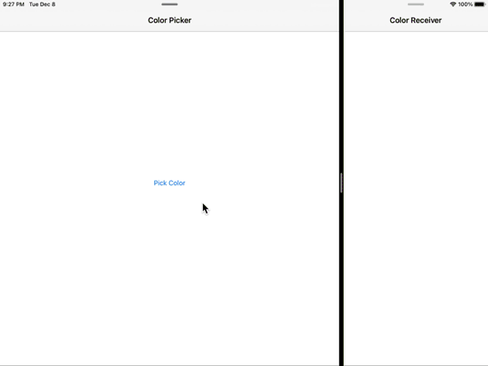

# Inter-process-UserDefaults
A simple UIKit app demonstrating sharing UserDefaults between iOS apps by using app groups.

The project contains two apps. One app writes user-selected color to the shared `UserDefaults`. Another app observes shared `UserDefaults` (with KVO) for changes of selected color and reacts by setting it's background color to the new value.

Requires iOS 14 or later as `UIColorPickerViewController` is used for selecting colors, but the inter-process `UserDefaults` observing has been working since iOS 10.

---
**NOTE**

For everything to work, following must be done:

- Add `App Group` capability to both targets and add the targets to the same group
- Set `colorPickerGroupID` in `SharedCode.swift` to be the name of that group
---

